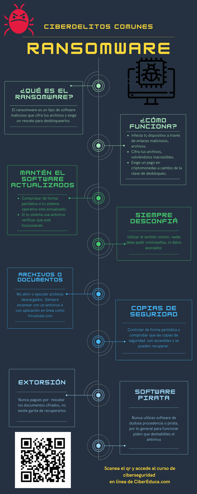

# Módulo 1:

## Audio:

El audio es una introducción al mundo de la ciberseguridad y su relevancia en la sociedad actual. Se destaca la creciente problemática de la ciberdelincuencia y su impacto en organizaciones públicas y privadas, incluyendo sectores vitales como la salud y la educación. Se plantea la necesidad de concienciar a mandos medios y líderes de empresas y entidades públicas sobre los riesgos y desafíos asociados con la ciberseguridad.

Aborda conceptos clave, como el ciberespacio, la ciberguerra y los ciberdelincuentes, resaltando cómo la tecnología ha evolucionado y se ha convertido en un campo de batalla en constante crecimiento. Se mencionan las amenazas actuales, incluyendo ataques de ransomware y el papel de los "bots" en los ataques cibernéticos.

Además, se plantean preguntas importantes relacionadas con el alcance de las amenazas, las leyes que regulan estos delitos y los problemas éticos y el impacto en las libertades individuales. 

Se hace hincapié la importancia de la capacitación continua en las organizaciones de afianzando conocimientos sólidos en ciberseguridad como un medio para prevenir desastres y mejorar la seguridad informática.

# Infografía sobre ransomware

## Autoevaluación relacionadas con el módulo para el alumno:

1. ¿Comprendí la importancia de la ciberseguridad en el contexto actual?

2. ¿Puedo explicar por qué la ciberseguridad es relevante para organizaciones?

3. ¿Entiendo cómo los ataques cibernéticos pueden tener un impacto en la salud, la educación y la economía?

4. ¿Puedo definir términos como ciberdelincuencia, ciberespacio y ciberguerra?

5. ¿Comprendo la diferencia entre los ataques de ransomware y otros tipos de ciberataques?

6. ¿Entiendo las implicaciones éticas y el impacto en las libertades?

7. ¿He considerado mi nivel de conocimiento en ciberseguridad y la importancia de la capacitación continua?

8. ¿Puedo explicar la importancia de generar conciencia y conocimientos sólidos en ciberseguridad?
