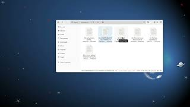
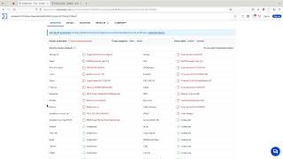
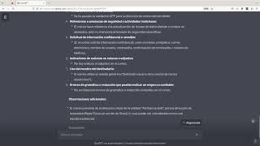

# Módulo 8: Seguridad en Correo Electrónico y Mensajería

* Cómo evitar el correo no deseado y el malware.

* Seguridad en aplicaciones de mensajería.

* Cuidado al descargar archivos adjuntos.

## Cápsula sobre detección de correos fraudulentos o maliciosos

## Cápsula sobre antivirus en línea para archivos

## Cápsula sobre uso de una IA para analizar correos electrónicos

